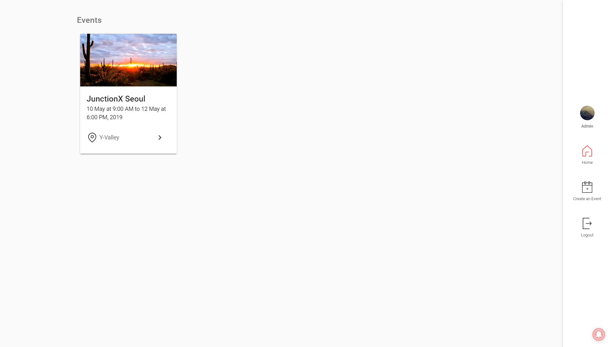

# Magpy

<p align="center"></p>

> Magpy Client: An Event Manager Software

## Demo



See [Demo](https://magpy-project.github.io/client/)

## Installation

- Clone the repo:

```bash
git clone https://github.com/magpy-project/client.git
```

## Build Setup

```bash
# install dependencies
$ npm install

# serve with hot reload at localhost:3000
$ npm run dev

# build for production and launch server
$ npm run build
$ npm start

# generate static project
$ npm run generate
```

For detailed explanation on how things work, checkout [Nuxt.js docs](https://nuxtjs.org).
